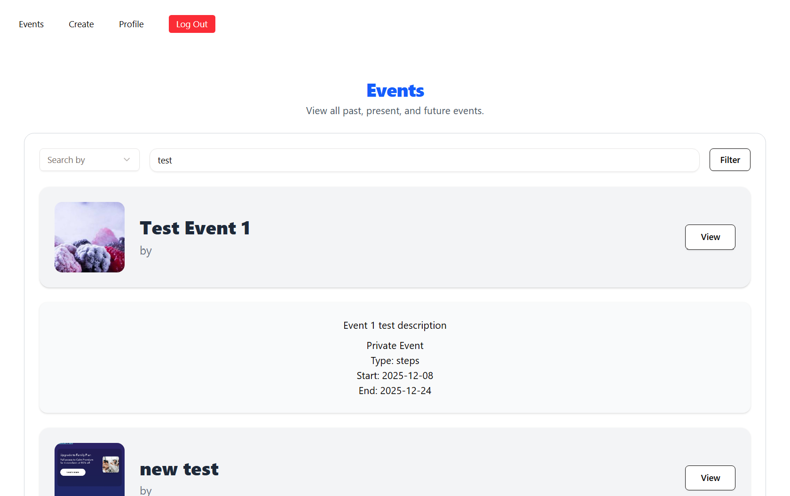
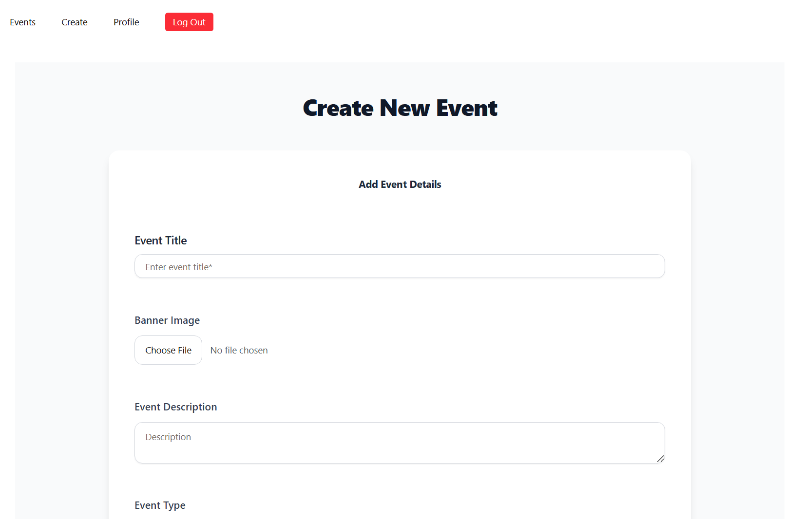
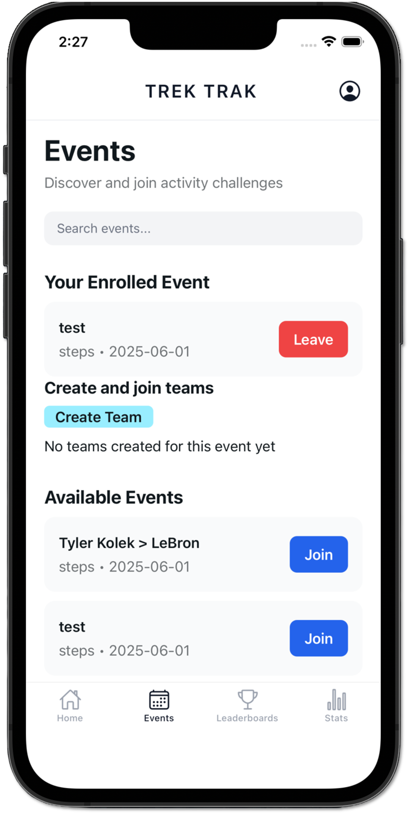
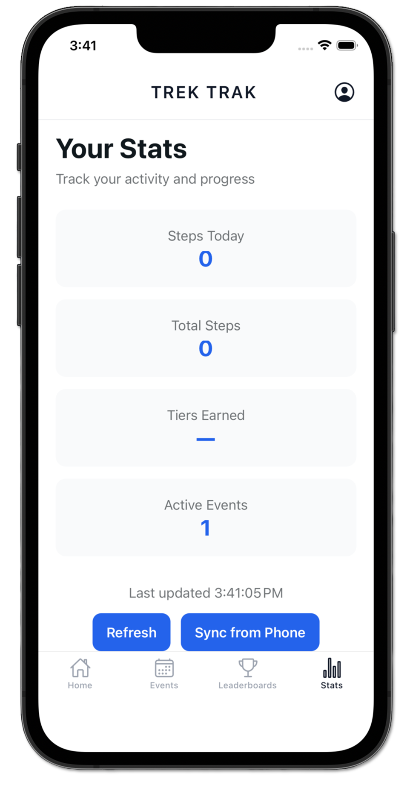

# TrekTrak
A fitness challenge platform built for organizations to run events and for participants to join and track their progress.

## What is TrekTrak
TrekTrak is a fitness event management platform created to fit the needs of fitness event organizations that want to hosting events. TrekTrak allows organizations create and run activity challenges like walking competitions without expensive per-event software fees.

Organizations manage everything from a web dashboard. Participants join events and track their progress from a mobile app on iOS or Android.

## The Problem We Are Solving
Fitness organizations often rely on costly per-event software to run simple activity challenges. These tools are:

- **Expensive**: Charged per event, per user, or via subscription
- **Inflexible**: Hard to customize for your specific challenge format
- **Inaccessible**: Too costly or complex for smaller organizations to use

Building custom software isn't realistic for most teams. TrekTrak fills that gap.

## Key Features

### For Organizations (Website)
- **Event creation & configuration** — Set up walking competitions, step challenges, 
  or custom activity campaigns in minutes
  
- **Participant management** — View registrations, track team or individual progress, 
  and manage event settings from a central dashboard
  
- **No per-event fees** — Host as many events as you need, for free

### For Participants (Mobile App)
- **Easy registration** — Join events with a simple sign-up flow
  {width=200px}
- **Progress tracking** — Log activity and monitor your standings in real time
  {width=200px}
- **Cross-platform** — Available on both iOS and Android

## Try It Out
### For Organizations
[TrekTrak Website: For Fitness Organization & Event Organizers](https://trek-trak-capstone.vercel.app/)
> Note: Organization/Organizer accounts must be created by an admin. To get access for your organization, reach out at admin@example.com and you'll recieve login credentials.
### For Participants
Coming soon to the App Store and Google Play

# Team

## (2025-26)
| Name | Role | GitHub | Contact |
|---|---|---|---|
| Wyatt Fujikawa | Frontend Development | [@Fujikaww](https://github.com/Fujikaww) | fujikaww@oregonstate.edu |
| Ella Gordon | Web/Mobile Development | [@ellagg](https://github.com/ellagg) | gordella@oregonstate.edu |
| Joseph Liefeld | Frontend / Security | [@josephliefeld](https://github.com/josephliefeld) | liefeldj@oregonstate.edu |
| Stephen Tsui | Backend Development | [@stephen1644](https://github.com/stephen1644) | tsuis@oregonstate.edu |
| Kekoa Young | Mobile Frontend/Backend | [@youngkek](https://github.com/youngkek) | youngkek@oregonstate.edu |

## Past Contributors
Web Team(Organizers):
Ali Akturin: akturial@oregonstate.edu
Yoonseong Shin: shinyo@oregonstate.edu
Yu-Siang Chou: chouyu@oregonstate.edu
Zhi Liang: liangz2@oregonstate.edu

Mobile Team(Participants):
Vincent La: lavi@oregonstate.edu
Vincent Le: levince@oregonstate.edu
Bruce Yan: yanbr@oregonstate.edu
Brayden Weigel: weigelb@oregonstate.edu

## References
- [React Documentation](https://react.dev/learn)
- [Tailwind CSS Documentation](https://tailwindcss.com/docs)
- [React Native Documentation](https://reactnative.dev/docs/getting-started)
- [Expo Documentation](https://docs.expo.dev/)
- [Supabase Documentation](https://supabase.io/docs)
- [Shadcn UI Documentation](https://ui.shadcn.com/docs)